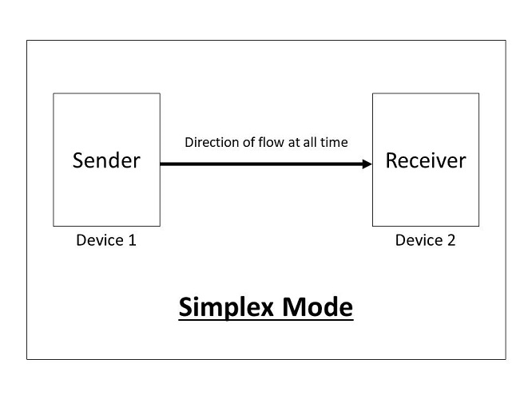
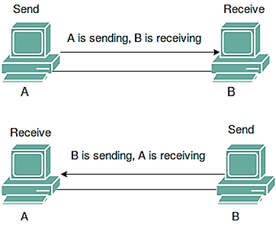
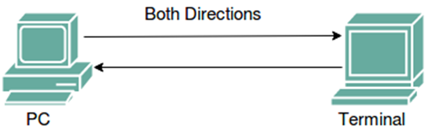

# Data Flow Modes

## Simplex mode

- In simplex transmission mode, the communication between sender and receiver occurs in only one direction.  The sender can only send the data, and the receiver can only receive the data.  The receiver cannot reply to the sender.
- Simplex transmission can be thought of as a one-way road in which the traffic travels only in one direction—no vehicle coming from the opposite direction is allowed to drive through.
- E.g. Keyboard and Monitor.

## Half Duplex Mode

- The communication between sender and receiver occurs in both directions in half duplex transmission, but only one at a time.  The sender and receiver can both send and receive the information, but only one is allowed to send at any given time. 
- Half duplex is still considered a one-way road, in which a vehicle traveling in the opposite direction of the traffic has to wait till the road is empty before it can pass through.
- E.g. in walkie-talkies, the speakers at both ends can speak, but they have to speak one by one.

## Full Duplex Mode

- In full duplex transmission mode, the communication between sender and receiver can occur simultaneously.  The sender and receiver can both transmit and receive at the same time.
- Full duplex transmission mode is like a two-way road, in which traffic can flow in both directions at the same time.
- E.g. in a telephone conversation, two people communicate, and both are free to speak and listen at the same time.

## Comparison of Simplex, Half Duplex and Full Duplex

| **Sr.**  **No** | **Basis for Comparison**   | **Simplex**                           | **Half Duplex**                                   | **Full Duplex**                                  |
| --------------- | -------------------------- | ------------------------------------- | ------------------------------------------------- | ------------------------------------------------ |
| 1               | Direction of Communication | Unidirectional                        | Two-directional, one at a time                    | Two-directional, simultaneously                  |
| 2               | Send / Receive             | Sender can only send data             | Sender can send and receive data, but  one a time | Sender can send and receive data  simultaneously |
| 3               | Performance                | Worst performing mode of transmission | Better than Simplex                               | Best performing mode of transmission             |
| 4               | Example                    | Keyboard and monitor                  | Walkie-talkie                                     | Telephone                                        |

