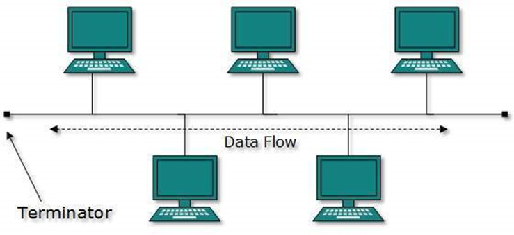
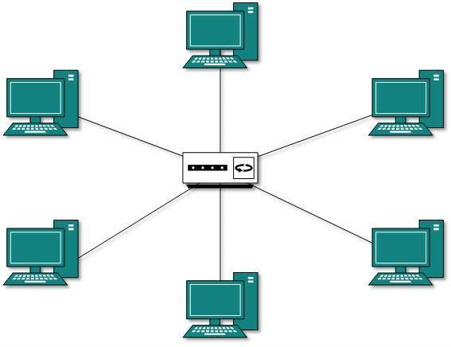
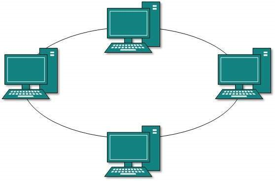
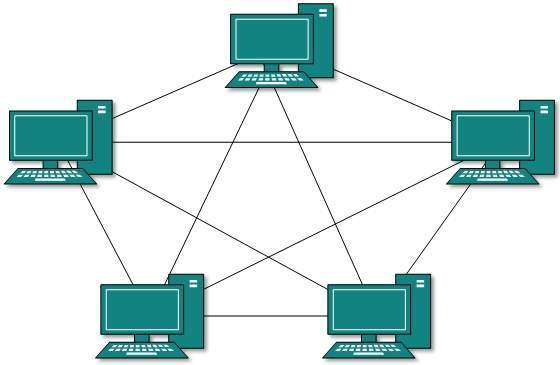
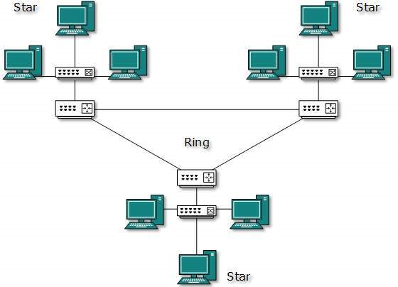

# Table of Contents

- [Network Topology](#network-topology)
- [Point to Point Topology](#point-to-point-topology)
- [Bus Topology](#bus-topology)
- [Star Topology](#star-topology)
- [Ring Topology](#ring-topology)
- [Mesh Topology](#mesh-topology)
- [Hybrid Topology](#hybrid-topology)

# Network Topology

- A Network Topology is the arrangement with which computer systems or network devices are connected to each other.
- Topologies may define both physical and logical aspect of the network. Both logical and physical topologies could be same or different in a same network.

**Types of Network Topology**

- Point to Point Topology
- Bus Topology
- Star Topology
- Ring Topology
- Mesh Topology
- Hybrid Topology

# Point to Point Topology

Point-to-point networks contains exactly two hosts such as computer, switches or routers, servers connected back to back using a single piece of cable. Often, the receiving end of one host is connected to sending end of the other and vice-versa.

## Advantages

- Highest Bandwidth because there is only two nodes having entire bandwidth of a link
- Very fast compared to other network topologies because it can access only two nodes.
- Very simple connectivity
- It provides low Latency
- Easy to handle and maintain

## Disadvantages

- This topology is only used for small areas where nodes are closely located.
- The entire network depends on the common channel in case of link broken entire network will become dead.

# Bus Topology

- In case of Bus topology, all devices share single communication line or cable. Bus topology may have problem while multiple hosts sending data at the same time.
- It is one of the simple forms of networking where a failure of a device does not affect the other devices. But failure of the shared communication line can make all other devices stop functioning.

- •In case of Bus topology, all devices share single communication line or cable. Bus topology may have problem while multiple hosts sending data at the same time.
- It is one of the simple forms of networking where a failure of a device does not affect the other devices. But failure of the shared communication line can make all other devices stop functioning.
- In a bus topology, one main cable acts as the backbone for the entire network.
- The bus topology carries the transmitted data along the cable. As the data reaches each node, the node checks the destination address (MAC/IP address) to see if it matches their address.
- If the address doesn’t match, the node does nothing more. But if the node addresses match to the address contained in the data then they process on the information.

## Advantages

- Easy to connect or remove devices in a network without affecting any other device.
- In case of any computer or device failure, there will be no effect on other devices or network.
- Cable cost is less as compared to other network topology i.e. mesh and star.
- It is easy to understand topology.

## Disadvantages

- In the case of any device failure, it is difficult to find faults in a network.
- If the backbone cable damages the entire system/network will fail.
- If network traffic increases or devices increase, the performance of the network decreases.
- It is slower because one computer transmits at a time.
- It provides very low security because all the computers receive the sent signal from the source.

# Star Topology

- In Start Topology, all the computers are connected to the central located device called as hub. 
- All the devices on the network are connected with a hub device through a communication link. 
- Each computer requires a single wire for the connection to the hub.
- In star Topology, there exists a point-to-point connection between a node and hub  (or other central) device. 
- The hub device takes a signal from any node and passes it to all the other nodes in the network. 
- The hub works as a server and it controls and manages entire function of the network.
- If one host needs to send data to some other host, it will send the message to the central connecting hub device. The central connecting hub device then replicates the message and forwards it on to the appropriate host.

## Advantages

- Easy to manage and maintain the network because each node require separate cable.
- Easy to locate problems because cable failure only affect a single user.
- Easy to extend the network without disturbing to the entire network
- Due to Hub device network control and management is much easier.
- Fault identification and removing nodes in a network is easy.
- It provides very high speed of data transfer.

## Disadvantages

- Entire performance of the network depends on the single device hub.
- If the hub device goes down, the entire network will be dead.
- Star topology requires more wires compared to the ring and bus topology.

# Ring Topology

- In Ring Topology, each device/node is connected with its neighboring node forming the shape of ring hence it is known as Ring Topology. 
- In ring topology the data circulate from one computer to another.  The flow of the data in ring topology can be uni-directional or bi-directional.
- In ring topology, each host machine connects to exactly two other machines, creating a circular network structure. 
- When one host tries to communicate or send message to a host which is not adjacent to it, the data travels through all intermediate hosts. 
- To connect one more host in the existing structure, the administrator may need only one more extra cable.

## Advantages

- Flow of data is in circular direction which minimizes the chance of packet collision.
- The uni-directional ring topology provides very high speed.
- It has better performance than bus topology, even when the nodes are increased.
- Ring network can handle high volume of nodes in a network (Robust).

- It can handle heavy traffic as compared to bus topology due to Token passing principal.
- Ring topology provides good communication over a long distance.
- There is no need of network server to control the flow of data.
- Troubleshooting in ring network is much easier because cable faults can be easily located.
- Ring network is less costly compared to the other topologies I.e. (mesh, hybrid, and tree topology).

## Disadvantages

- A single break in the cable can cause disturbance in the entire network
- In Uni-directional Ring, a data packet (token) must pass through all the nodes.
- Addition and removal of any node in a network is difficult and can cause issue in network activity.

# Mesh Topology

- In Mesh Topology, all the computers are inter-connected to each other in a network. 
- Each computer not only sends its own signals but also relays data from other computers. 
- This type of topology is very expensive as Its very difficult to establish the connections of the mesh topology. 
- In a Mesh topology every node has a point-to-point connection to the other node.
- Mesh Topology can be divided into two types:
  - **Fully connected mesh topology:** In fully connected mesh topology all nodes of network are connected to all other nodes with point to point connection.
  - **Partially connected mesh topology:** In partially connected mesh topology all nodes of network may not be connected with all other nodes with point to point connection.

## Advantages

- There is no traffic problem as there are dedicated point to point links for each computer.
- It has multiple links, so if one route is blocked then other can be accessed for data communication.
- It provides high privacy and security.
- Fault identification is easy because of point-to-point connection.

## Disadvantages

- Mesh topology requires high number of cables and I/o ports for the communication.
- Installation is very difficult in mesh topology, as each node is connected to every node.
- Mesh topology is costly compared to the other network topologies i.e. star, bus, point to point topology.

# Hybrid Topology

- A network structure whose design contains more than one topology is said to be hybrid topology. 
- Hybrid topology inherits merits and demerits of all the incorporating topologies.

